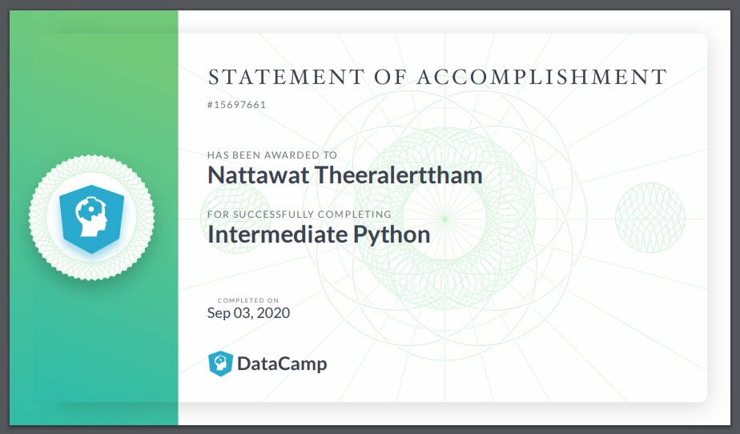

# Welcome to Topp's GitHub Profile!

<a href="https://www.youtube.com">&nbsp;&nbsp;<a href="https://www.linkedin.com/in/topp-theeralerttham-54743264/">&nbsp;&nbsp;<a href="https://tnattawat.github.io/Portfolio/">&nbsp;&nbsp;<a href="https://www.kaggle.com/">

# Data Projects @DataCamp.com
# [Project #1: TV, Halftime Shows, and the Big Game of Super Bowl (Click!)](https://github.com/tnattawat/Topp/blob/master/Project1/notebook.ipynb) 

Whether or not you like football, the Super Bowl is a spectacle. There's drama in the form of blowouts, comebacks, and controversy in the games themselves. There are the ridiculously expensive ads, some hilarious, others gut-wrenching, thought-provoking, and weird. In this project, you will find the answer to interesting questions like:
* What are the most extreme game outcomes?
* How does the game affect television viewership?
* How have viewership, TV ratings, and ad cost evolved over time?
* Who are the most prolific musicians in terms of halftime show performances?

The dataset used in this project was scraped and polished from Wikipedia. It is made up of three CSV files, one with game data, one with TV data, and one with halftime musician data for all 52 Super Bowls through 2018.

# Training Milestones & Certficates
<a href="https://www.datacamp.com/statement-of-accomplishment/course/5bb2a0f8da6581f8e193b1d8175e0a4a38bcf450">&nbsp;&nbsp;
<a href="https://www.datacamp.com/statement-of-accomplishment/course/efb6d01ce9a8cd9f43f3d2f618eca39f1db61d41">&nbsp;&nbsp;
<a href="https://www.datacamp.com/statement-of-accomplishment/course/8884ec72e6c9c880c7c0e533d6a7a4271175ddb2">&nbsp;&nbsp;
<a href="https://analytics.google.com/analytics/academy/certificate/F84hMIYtTluVjyuc4kbrvQ">&nbsp;&nbsp;
<a href="https://learndigital.withgoogle.com/link/1qsdpcedm9s">&nbsp;&nbsp;
<a href="https://www.youracclaim.com/badges/1c2a64a3-1bab-4bed-8058-f9896b797821?source=linked_in_profile">&nbsp;&nbsp;
