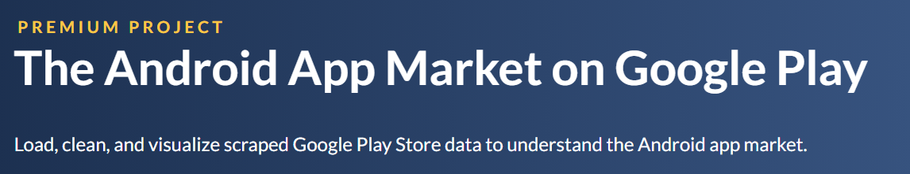
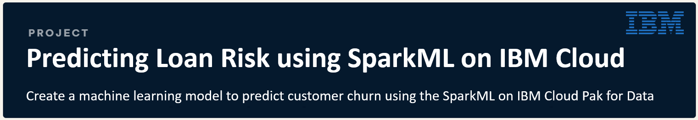

# Welcome to Topp's GitHub Profile!

<a href="https://www.youtube.com">&nbsp;&nbsp;<a href="https://www.linkedin.com/in/topp-theeralerttham-54743264/">&nbsp;&nbsp;<a href="https://tnattawat.github.io/Portfolio/">&nbsp;&nbsp;<a href="https://www.kaggle.com/topptheeralerttham/">

# Data Projects @DataCamp.com
# [Project #1: TV, Halftime Shows, and the Big Game of Super Bowl (Click!)](https://nbviewer.jupyter.org/github/tnattawat/Topp/blob/master/Project1/notebook.ipynb) 

Whether or not you like football, the Super Bowl is a spectacle. There's drama in the form of blowouts, comebacks, and controversy in the games themselves. There are the ridiculously expensive ads, some hilarious, others gut-wrenching, thought-provoking, and weird. In this project, you will find the answer to interesting questions like:
* What are the most extreme game outcomes?
* How does the game affect television viewership?
* How have viewership, TV ratings, and ad cost evolved over time?
* Who are the most prolific musicians in terms of halftime show performances?

The dataset used in this project was scraped and polished from Wikipedia. It is made up of three CSV files, one with game data, one with TV data, and one with halftime musician data for all 52 Super Bowls through 2018.

# [Project #2: The Android App Market on Google Play (Click!)](https://nbviewer.jupyter.org/github/tnattawat/Topp/blob/master/Project2/notebook.ipynb)

Mobile apps are everywhere. They are easy to create and can be lucrative. Because of these two factors, more and more apps are being developed. With data scraped from the Google Play Store, this project will do a comprehensive analysis of the Android app market by comparing over ten thousand apps in Google Play across different categories. You'll find insights to devise strategies to drive growth and retention such as:
* Does the size and price of an app affect its rating?
* Do users really care about system-heavy apps or do they prefer light-weighted apps?
* Do users always prefer free apps over paid apps (sentiment analysis of user reviews)?
* Is there a relation between app category and app price?

The data was scraped from the Google Play website. The data files include 'apps.csv' containing 13 features that describe apps on Google Play, and 'user_reviews.csv' containing 100 reviews for each app.

# [Project #3: The GitHub History of the Scala Language (Click!)](https://nbviewer.jupyter.org/github/tnattawat/Portfolio/blob/master/Project3/notebook.ipynb)

Open source projects contain entire development histories, such as who made changes, the changes themselves, and code reviews. This project takes the challenge to read in, clean up, and visualize the real-world project repository of Scala that spans data from a version control system (Git) as well as a project hosting site (GitHub). With almost 30,000 commits and a history spanning over ten years. Scala is a mature language. You will find the answers to fun questions like:
* Who are the experts in the history of Scala?
* Who has had the most influence on its development?
* Is there camaraderie in the Scala project?
* What do the contributions of two biggest developers look like?

The dataset includes the project history of Scala retrieved from Git and GitHub as a set of CSV files.

# [Project #4: A Visual History of Nobel Prize Winners (Click!)](https://nbviewer.jupyter.org/github/tnattawat/Portfolio/blob/master/Project4/notebook.ipynb)

The Nobel Prize is perhaps the world's most well known scientific award. Every year it is given to scientists and scholars in chemistry, literature, physics, medicine, economics, and peace. This project uses data manipulation and visualization libraries in Python to explore patterns and trends over 100 years worth of Nobel Prize winners. You will find out the following:
* what characteristics do the prize winners have? 
* What are age differences between prize categories?
* Has anybody gotten it twice?
* Which country gets it most often? 

The dataset used in this project is from The Nobel Foundation on Kaggle.

# [Project #5: The Discovery of Handwashing (Click!)](https://nbviewer.jupyter.org/github/tnattawat/Portfolio/blob/master/Project5/notebook.ipynb)

In 1847, the Hungarian physician Ignaz Semmelweis made a breakthough discovery: he discovers handwashing. Contaminated hands was a major cause of childbed fever and by enforcing handwashing at his hospital he saved hundreds of lives. This project will reanalyze the medical data Semmelweis collected and answer the following questions:
* What were the proportions of deaths before and after Semmelweis made handwashing obligatory?
* Did more handwashing lead to fewer deaths?
* How much did handwashing reduce the monthly proportion of deaths on average?
* What is the confidence interval?

The dataset used in this project is from one of the most important discoveries of modern medicine: handwashing.

# [Project #6: Predicting Credit Card Approvals (Click!)](https://nbviewer.jupyter.org/github/tnattawat/Portfolio/blob/master/project6/notebook.ipynb)

Commercial banks receive a lot of applications for credit cards. Many of them get rejected for many reasons, like high loan balances, low income levels, or too many inquiries on an individual's credit report, for example. Manually analyzing these applications is mundane, error-prone, and time-consuming (and time is money!). Luckily, this task can be automated with the power of machine learning and pretty much every commercial bank does so nowadays. In this project builds an automatic credit card approval predictor using machine learning techniques, just like the real banks do. 

The dataset is the Credit Card Approval dataset from the UCI Machine Learning Repository.

# [Project #7: School Budgeting with Machine Learning (Click!)](https://nbviewer.jupyter.org/github/tnattawat/Portfolio/blob/master/project7/notebook.ipynb)
Data science isn't just for predicting ad-clicks-it's also useful for social impact! This project explores a problem related to school district budgeting. By building a model to automatically classify items in a school's budget, it makes it easier and faster for schools to compare their spending with other schools. It uses natural language processing to prepare the budgets for modeling and applies different techniques to make the model most accurate.

# Data Projects in the Real World
# [Project #1: Predicting Loan Risk using SparkML on IBM Cloud (Click!)](https://nbviewer.jupyter.org/github/tnattawat/Topp/blob/master/P1/machinelearning-creditrisk-sparkmlmodel.ipynb) 

This project will create a machine learning model to predict customer churn. It will build the prediction model using the SparkML library, and walk you through these steps:
* Load and Visualize data set.
* Build a predictive model with SparkML API
* Save the model in the ML repository

This project is part of my training at IBM Digital Developer Conference 2020 on Data & AI.

# Skills & Certficates
## 1. DataCamp
<a href="https://www.datacamp.com/statement-of-accomplishment/course/8884ec72e6c9c880c7c0e533d6a7a4271175ddb2">&nbsp;
<a href="https://www.datacamp.com/statement-of-accomplishment/course/efb6d01ce9a8cd9f43f3d2f618eca39f1db61d41">&nbsp;
<a href="https://www.datacamp.com/statement-of-accomplishment/course/5bb2a0f8da6581f8e193b1d8175e0a4a38bcf450">&nbsp;
<a href="https://www.datacamp.com/statement-of-accomplishment/course/8884ec72e6c9c880c7c0e533d6a7a4271175ddb2">&nbsp;
<a href="https://www.datacamp.com/statement-of-accomplishment/course/a3212b8f5b5c06ad652446ffaca509b960c4a339">&nbsp;
<a href="https://www.datacamp.com/statement-of-accomplishment/course/a3212b8f5b5c06ad652446ffaca509b960c4a339">&nbsp;
<a href="https://www.datacamp.com/statement-of-accomplishment/course/a1827e2ec40f8a3a5df3a7957a04fb3bbce6703f">&nbsp;
<a href="https://www.datacamp.com/statement-of-accomplishment/course/8884ec72e6c9c880c7c0e533d6a7a4271175ddb2">&nbsp;
<a href="https://www.datacamp.com/statement-of-accomplishment/course/8884ec72e6c9c880c7c0e533d6a7a4271175ddb2">&nbsp;
<a href="https://www.datacamp.com/statement-of-accomplishment/course/8884ec72e6c9c880c7c0e533d6a7a4271175ddb2">&nbsp;

## 2. Institutions in Thailand
<a href="https://github.com/tnattawat/Portfolio/blob/master/assets/cert/certificate_Chula.jpg?raw=true">&nbsp;

## 3. Google & Facebook
<a href="https://analytics.google.com/analytics/academy/certificate/F84hMIYtTluVjyuc4kbrvQ">&nbsp;
<a href="https://learndigital.withgoogle.com/link/1qsdpcedm9s">&nbsp;
<a href="https://www.youracclaim.com/badges/1c2a64a3-1bab-4bed-8058-f9896b797821?source=linked_in_profile">&nbsp;
